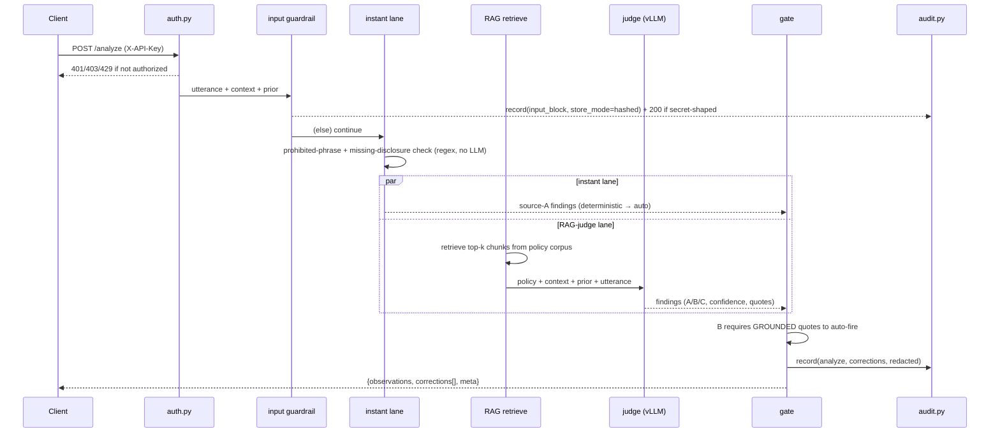
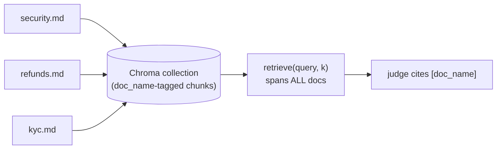
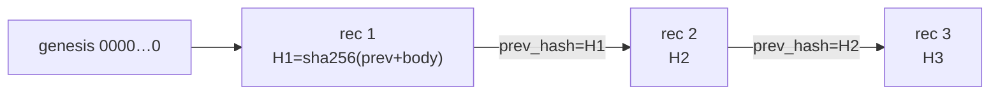
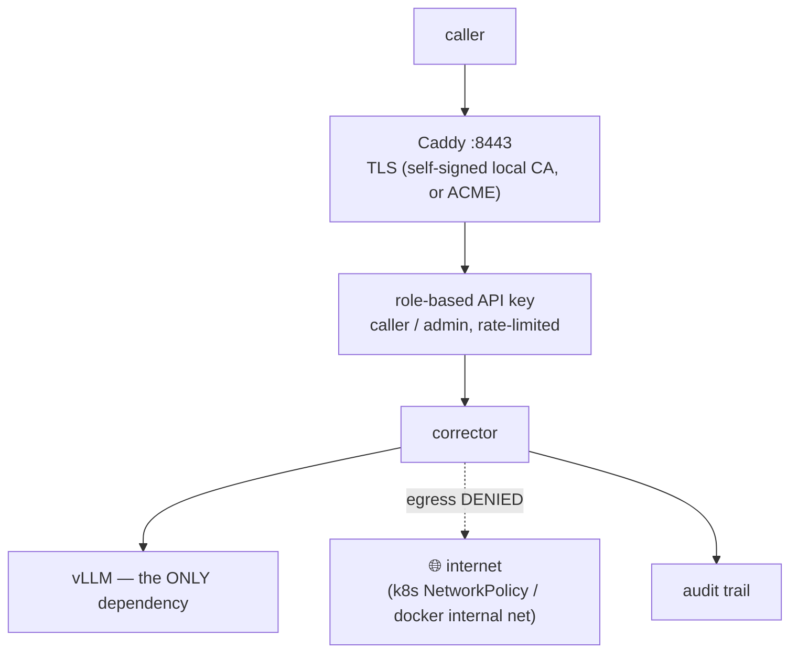
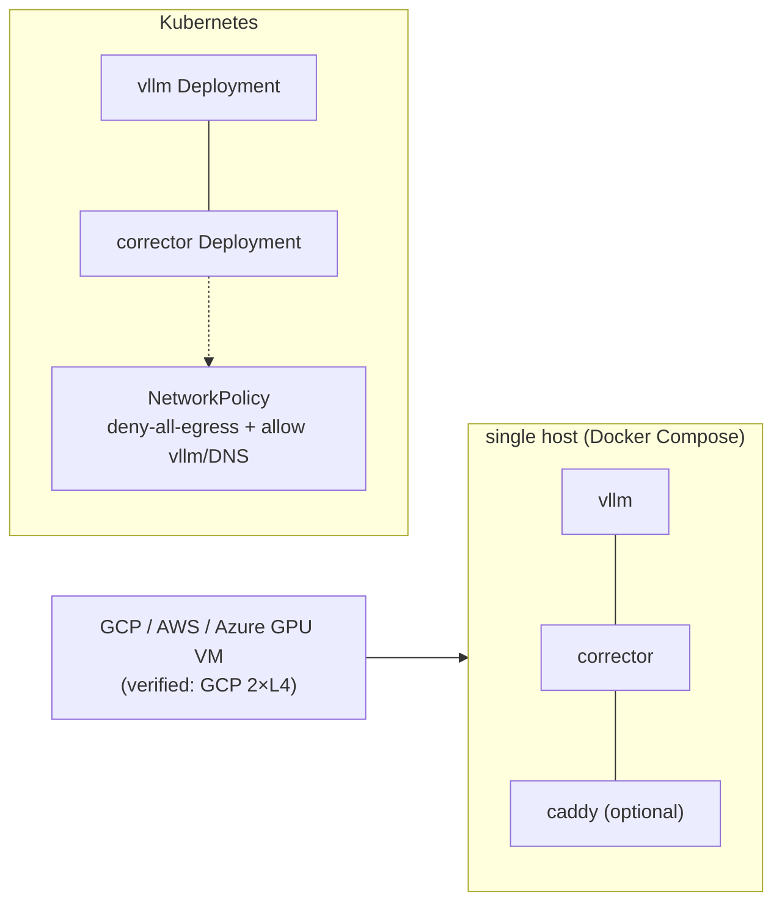

# High-Level Design — onprem-corrector

A self-hosted, zero-egress compliance corrector for AI/human agents. This document is the
end-to-end architecture: problem, components, data flow, security model, and deployment
topology. For API request/response shapes see [`docs/API.md`](docs/API.md); for accuracy
numbers see [`docs/EVAL.md`](docs/EVAL.md).

## 1. Problem statement

A regulated call — banking, healthcare, insurance, telecom — needs an independent supervisor
that catches when an agent (human or AI) says the wrong thing: quotes the wrong fee, skips a
mandatory disclosure, contradicts itself, or is rude. The obvious approach — pipe every
transcript to a cloud moderation LLM — fails on **data residency**: DPDP / RBI / HIPAA /
PCI-DSS often forbid letting customer data round-trip to a third-party API. onprem-corrector
is the same capability, run entirely on **your** hardware, grounded in **your** policy, with
**zero network egress**.

## 2. System architecture

```mermaid
flowchart TB
  APP["your agent app<br/>(voice / chat)"] -->|HTTPS + X-API-Key| CADDY["Caddy<br/>TLS termination :8443"]
  subgraph BOX["your infrastructure — nothing leaves"]
    CADDY -->|plaintext, internal net| API["corrector FastAPI :5244<br/>(loopback-only w/o Caddy)"]
    subgraph API_INT["corrector"]
      AUTH["auth.py<br/>role-based API keys"] --> GUARD["input guardrail<br/>(secrets/injection)"]
      GUARD --> INSTANT["instant lane<br/>(deterministic, sub-ms)"]
      GUARD --> RAG["RAG-judge lane<br/>(retrieve → Nemotron)"]
      INSTANT --> GATE["honest gate<br/>auto / propose / drop"]
      RAG --> GATE
      GATE --> AUDIT["audit.py<br/>hash-chained log"]
    end
    CORPUS[("policy corpus<br/>(Chroma, multi-doc)")] --- RAG
    VLLM["vLLM :8000<br/>Nemotron on your GPU"] --- RAG
  end
  GATE -->|corrections[]| APP
```

**Two containers, one host (minimum footprint):**
| Container | Role | Talks to |
|---|---|---|
| `vllm` | Serves the LLM judge (OpenAI-compatible API) | Hugging Face (weights, first pull only) or nothing (mounted weights) |
| `corrector` | FastAPI app — auth, guardrail, both detection lanes, gate, audit, RAG corpus | `vllm` only |
| `caddy` *(optional)* | TLS termination for network access | `corrector` (internal docker network) |

No component calls any external API at request time. `vllm`'s only egress is the one-time
Hugging Face model pull (or none, if weights are mounted).

## 3. Request lifecycle — `POST /v1/corrector/analyze`



Every request either gets a **guardrail block** (secret/injection detected, input never
reaches the judge) or runs **both lanes in the same call**: the deterministic instant lane
(regex over the corpus's extracted rules) and the RAG-judge lane (retrieve → one Nemotron
call). Every outcome — block or verdict — is written to the audit trail before the response
returns.

## 4. Detection lanes and the honest gate

| Source | What it means | Detector | Auto-fire condition |
|---|---|---|---|
| **A** | Policy/compliance breach (prohibited phrase, missing disclosure, unsupported claim) | instant lane (deterministic) or RAG-judge | Deterministic instant hit → **auto**. LLM-derived A → always **propose** (an LLM's own confidence report is not trusted for auto-action) |
| **B** | Self-contradiction vs. the agent's own earlier words | RAG-judge only | **auto** only if both quotes are **grounded** (verified present in the real transcript, not just claimed by the model) and confidence ≥ 0.8 |
| **C** | Tone/empathy miss | RAG-judge only | Never auto — always **propose** |

Every finding below confidence 0.5 is **dropped**. The gate's governing principle: *never
auto-act on an unverified model claim.* This is why source-A LLM findings never auto-fire
(the model reports confidence=1.0 indiscriminately) and why source-B requires quote grounding
(a hardening fix — see §8).

## 5. Policy corpus (multi-document RAG)

Real policy isn't one file — a security policy, a refunds policy, a KYC guide, each owned by
a different team. The corpus stores **named documents**, each chunked and embedded (local
MiniLM, no egress) into Chroma with a `doc_name` tag per chunk.



- `POST /v1/policy/documents?name=X` — add/replace one document; other documents untouched.
- `DELETE /v1/policy/documents/{name}` — remove one document.
- `POST /v1/policy/bulk` — a ZIP of `.md` files, one call.
- `POST /v1/policy/upload` — back-compat: replaces the whole corpus with a single `default` doc.
- Instant-lane rules (prohibited phrases, required disclosures) are **merged** (union) across
  every document in the corpus.
- **Correctness invariant:** updates are **add-then-delete** — new chunks are written and the
  corpus metadata is atomically swapped *before* old chunks are purged, so a concurrent
  `/analyze` call can never observe an empty policy mid-update (which would silently return a
  false-negative "clean" verdict on a real breach).

## 6. Audit trail (tamper-evident)

Every verdict, policy change, and guardrail block is appended to a **hash-chained** JSONL
log: `hash = sha256(prev_hash + canonical_json(record))`. Tampering with or deleting any past
record breaks every hash after it — detectable and pinpointable **offline**, no external
service needed (`GET /v1/audit/verify`).



- **Redaction:** `AUDIT_STORE_MODE` = `redacted` (PII/secrets masked, default) | `hashed`
  (only a `sha256` of the text kept) | `full`. Inputs the guardrail already flagged as
  secret-bearing are **force-hashed** regardless of the global mode.
- **Retention:** whole daily segments are pruned (`AUDIT_RETENTION_DAYS`); a `pruned` boundary
  marker keeps the retained window independently verifiable.
- Admin-only read API (`GET /v1/audit`, `/verify`, `/stats`), gated by API key.

## 7. Security architecture



| Layer | Mechanism | Default |
|---|---|---|
| Transport | Caddy TLS termination overlay; self-signed via Caddy's offline local CA (no egress) or ACME (opt-in, does call out) | plaintext port loopback-only until the overlay is added |
| AuthN/Z | `X-API-Key`; role `caller` (analyze) vs `admin` (policy write, audit read) | open with a startup warning if no keys are set; `AUTH_REQUIRED=true` to hard-refuse |
| Rate limiting | Per-identity sliding window | off (`RATE_LIMIT_PER_MIN=0`) |
| Network egress | k8s `NetworkPolicy` (default-deny + allow DNS/vLLM) or docker `internal: true` overlay; `scripts/egress_check.py` proves it | not enforced until an overlay/policy is applied |
| Supply chain | `scripts/gen_sbom.py` (CycloneDX); pinned deps | — |

Defaults favor a zero-config demo (open, plaintext-loopback); every control is one file/env
away from "hard".

## 8. Hardening history (what two adversarial audits + a self-review found)

| Bug | Impact | Fix |
|---|---|---|
| Source-B auto-fired on **fabricated** LLM quotes | Wrong "you contradicted yourself" auto-correction on words never said | `app/grounding.py` — quotes must be verifiably present in the transcript to count toward auto-fire |
| Audit redactor missed bearer tokens / AWS keys / PEM blocks | Secret persisted **unremovably** in the immutable chain | Hardened redactors; guardrail-flagged inputs force-store as a hash |
| Policy re-upload could expose an **empty** corpus mid-write | Concurrent `/analyze` false-negative "clean" on a real breach | Add-then-delete + a single atomic metadata swap |
| Bulk-ZIP keyed documents by **basename** | `security/x.md` and `refunds/x.md` collided; one silently overwrote the other | Key by sanitized full path, dedupe, size caps |
| Prohibited-phrase match was a **raw substring** | `"pin"` false-fired on `"typing"` — wrong auto-correction on a benign line | Word-boundary match (`app/matching.py`) |

All five are covered by regression tests (`scripts/test_bugfixes.py`, `scripts/test_rag_corpus.py`).

## 9. Deployment topology



Portable by **environment variables alone** — the same images run on a bare-metal GPU box, a
cloud GPU VM, or a Kubernetes cluster with a GPU node pool. Weights are never baked into an
image: pulled from Hugging Face at first start, or mounted for air-gapped deployments.

## 10. Evaluation (measured, not asserted)

`scripts/eval.py` scores recall/false-positive-rate/latency against labeled packs and
sweeps the confidence threshold to calibrate the `AUTO` gate from data. Latest result
(Nemotron-Nano-9B, 2× L4): **100% recall** across sources A/B/C/BLOCKED, 25% FPR on a small
benign sample (surfaces as `propose`, not `auto`), gate cutoff of 0.80 validated as sitting on
the F1 plateau. Full methodology and numbers: [`docs/EVAL.md`](docs/EVAL.md).

## 11. Known limitations / roadmap

- Rate limiter and audit chain are **single-process** state — running multiple replicas needs
  a shared rate-limit store and per-replica audit sharding (or the SQLite mirror sink).
- Guardrail-triggered blocks currently drop the **whole turn** (no analysis at all) rather than
  sanitize-and-continue — a deliberate safety trade documented, not a defect.
- FPR should be re-measured against the **customer's own** SOP and call patterns before trusting
  the gate thresholds in a new domain.

## 12. References

[`README.md`](README.md) (product overview) · [`docs/API.md`](docs/API.md) (endpoint contract) ·
[`docs/EVAL.md`](docs/EVAL.md) (accuracy methodology) · [`deploy/README.md`](deploy/README.md)
(deployment + security runbook).
